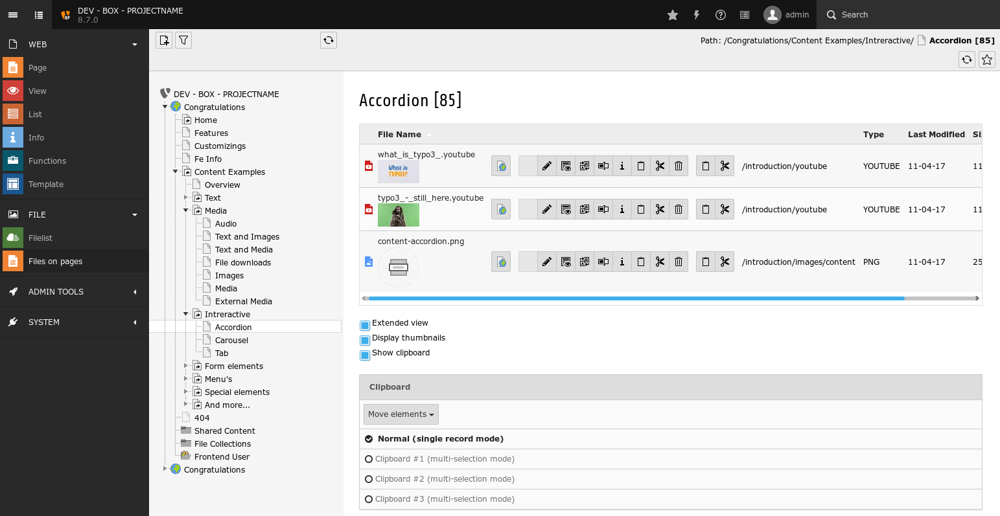

.. include:: ../Includes.txt

Introduction
============

What does it do?
----------------

This extension provides a backend module which is basically a clone of the *FILE > Filelist* module with the difference
that the page tree is used for navigation. That means the files used on a page are displayed in the list module.

One benefit is that one can quickly move the files used on a page to the clipboard and in the *FILE > Filelist* paste
those files inside a folder. This way you can organize files which are directly uploaded in content elements in a folder
structure.

Screenshots
-----------

The module looks like this:

    looks familiar, right?

