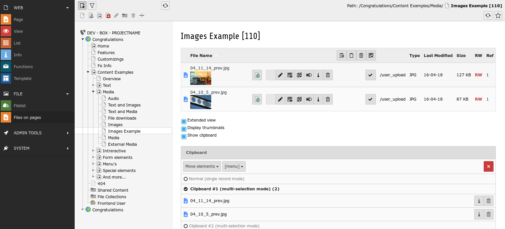
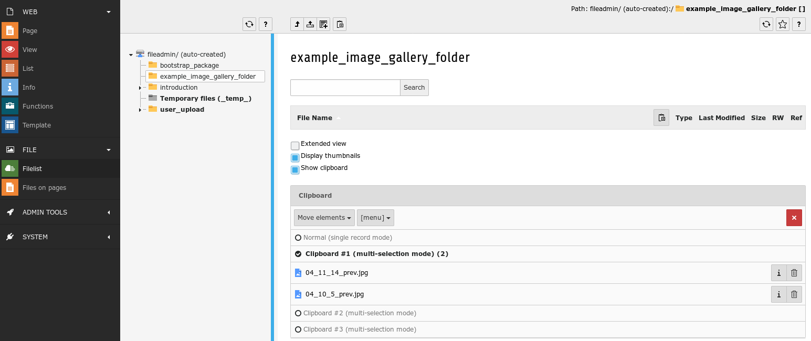

.. ==================================================
.. FOR YOUR INFORMATION
.. ================================================--
.. -*- coding: utf-8 -*- with BOM.

.. include:: ../Includes.txt

Users Manual
============

The module works the same as the Filelist module but in a page context. You select a page and see a list of files used
on that page.

This functionality allows you to see and manage files on a page, but it also allows to select files used on a page to
copy or move them with the clipboard.

Move files from user_upload to other directory
----------------------------------------------

Let's say you added one or more content elements with images on a page.

The images are added using the upload function inside the content element. As a result the files will be stored in
**fileadmin/user_upload/**. This is a nice and easy way to add files but they are hard to find files in **user_upload/**.

Now you have the idea to have a nice image gallery using those images. You have an image gallery plugin installed
which uses file collections.

You could add a file collection and add those files by searching them in **user_upload/** which usually means you have
to take notes about the file names.

The other way is to go to the *Files on page* module and put those files on the clipboard.

    put files used on the page *Images Example* onto the clipboard

Now you switch to the *Filelist* module and select the desired folder or create a new folder for the files of your image
gallery.

    files on the clipboard can be pasted to move them to the new folder

When you paste the files using the *Move elements* clipboard mode, the files will be moved from **user_upload/** to the
new folder.

Now you can select the folder in the file collection to create a gallery. This is a quick and easy way to organize your
files which are located in **user_upload/**.

FAQ
---

:Question: When the files are moved will the files be removed from the content element they are used on?
:Answer: No. The images are still used by the content elements, only the folder where the files are stored has changed.

:Question: Is this only useful for image galleries?
:Answer: Of course not. This method can be used to reorganise your files which makes them easier to reuse.

